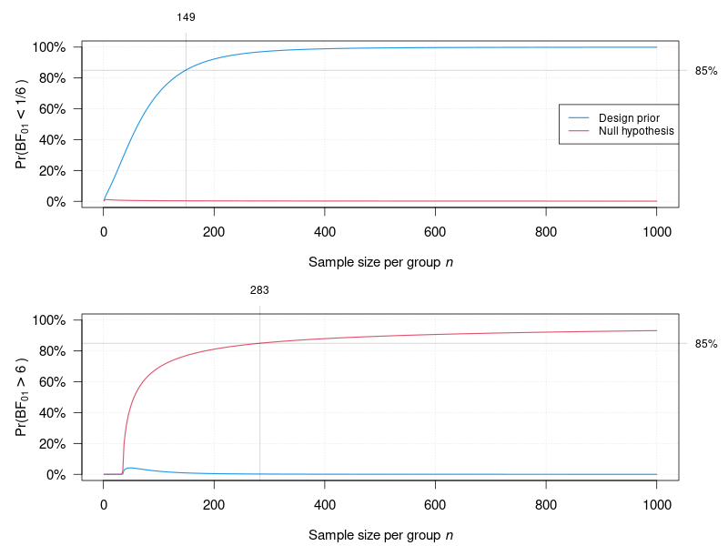

# bfpwr

**bfpwr** is an R package for power and sample size calculations for planned
Bayes factor analyses

## Installation

```r
## ## CRAN version (not yet available on CRAN)
## install.packages("bfpwr")

## from GitHub
## install.packages("remotes") # requires remotes package
remotes::install_github(repo = "SamCH93/bfpwr", subdir = "package")
```

## Usage

The workhorse function of the package is `powerbf01`. It is inspired by the
`stats::power.t.test` function, with which many user will be familiar. As
`stats::power.t.test`, the function `powerbf01` assumes that the data are
continuous and that the parameter of interest is either a mean or a
(standardized) mean difference. The functions `pbf01` and `nbf01` are more
general and can be used for any approximately normally distributed parameter
estimate with approximate variance, although users have to specify the unit
variance themselves. Similar functions exists also for *t*-test Bayes factors
(`tbf01` and `powertbf01`) and normal moment prior Bayes factors (`nmbf01` and
`powernmbf01`). The following code chunk illustrate how `powerbf01` can be used.


``` r
library(bfpwr)

## Bayes factor analysis parameters
null <- 0 # null value
sd <- 1 # standard deviation of one observation
pm <- null # analysis prior centered around null value
psd <- sqrt(2) # unit information SD for a standardized mean difference (SMD)
type <- "two.sample" # two-sample test

## design prior parameters
dpm <- 0.5 # design prior mean equal to large SMD effect size
dpsd <- 0.1 # design prior sd to incorporate parameter uncertainty

## determine sample size to achieve 85% power
k <- 1/6 # BF threshold
power <- 0.85
ssd <- powerbf01(k = k, power = power, sd = sd, null = null, pm = pm, psd = psd,
                 dpm = dpm, dpsd = dpsd, type = type)
ssd


#>      Two-sample z-test Bayes factor power calculation 
#> 
#>                         n = 148.5498
#>                     power = 0.85
#>                        sd = 1
#>                      null = 0
#>       analysis prior mean = 0
#>         analysis prior sd = 1.414214
#>         design prior mean = 0.5
#>           design prior sd = 0.1
#>            BF threshold k = 1/6
#> 
#> NOTE: BF oriented in favor of H0 (BF < 1 indicates evidence for H1 over H0)
#>       n is number of *samples per group*
#>       sd is standard deviation of one sample (assumed equal in both groups)


## plot power curve
plot(ssd, nlim = c(1, 1000), ngrid = 500)
``` 


<!-- png(filename = "power.png", width = 1*800, height = 1*600, pointsize = 15); plot(ssd, nlim = c(1, 1000), ngrid = 500); dev.off() -->
